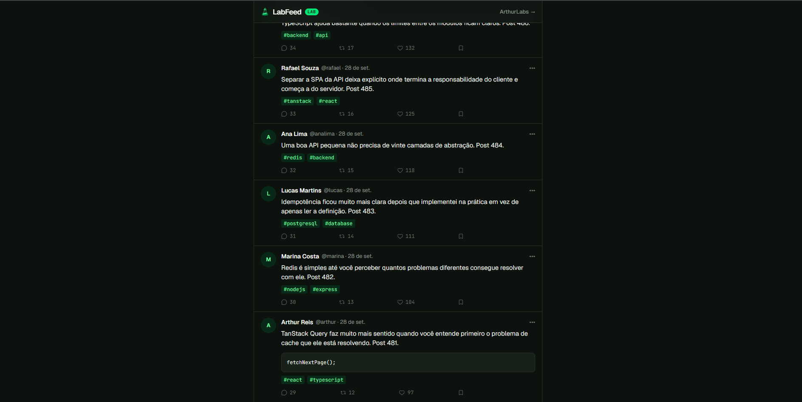
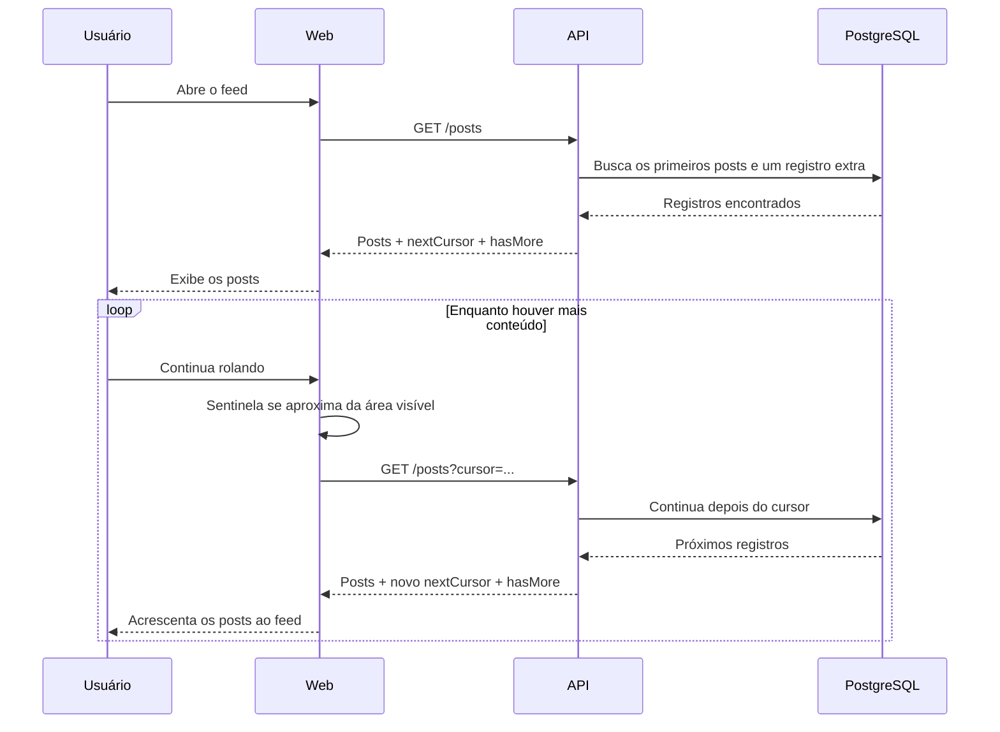

# LabFeed

Experimento de feed infinito para estudar **cursor-based pagination**, da continuação da consulta na API ao carregamento progressivo dos posts no frontend.

**Demo:** 

## Contexto

Uma API geralmente não envia centenas ou milhares de registros de uma vez. Se um feed tem 500 posts, ela pode entregar os primeiros 10 e buscar mais 10 quando a pessoa precisar continuar. Dividir os dados em partes menores é o que chamamos de **paginação**.

Uma forma comum de imaginar isso é por páginas: página 1, página 2, página 3. Nesse modelo, a API recebe uma posição, ou *offset*: primeiro pega 10 registros; depois pula 10 e pega os próximos 10; depois pula 20. Funciona bem para muitas listas, mas um feed pode mudar enquanto alguém o lê. Imagine que a primeira consulta retornou os posts `10, 9, 8, 7, 6`. Se novos posts entrarem no início, as posições dos antigos mudam. Pedir a próxima parte pela posição pode repetir ou deixar passar um post.

Com **cursor-based pagination**, a continuação parte de um registro conhecido. O cursor significa: “parei aqui; continue depois deste item”. Se a primeira resposta do LabFeed contém `500, 499, 498, 497, 496`, a API informa `nextCursor = 496`. Na próxima consulta, o frontend pede para continuar depois do post `496` e recebe `495, 494, 493, 492, 491`.

Essa é a diferença central: uma página diz “quero a segunda parte por posição”; um cursor diz “continue depois deste registro”. O cliente não precisa saber o número de uma página: ele conhece os posts recebidos, a referência para continuar e se há mais conteúdo. Um cursor não precisa ser numérico nem ser sempre um ID; neste experimento, o ID do post torna a sequência fácil de visualizar.

Para descobrir se existe uma próxima parte, a API pode buscar **um registro a mais**. Se o pedido é de 10 posts e a consulta encontra 11, ela envia 10 e sinaliza `hasMore = true`; o registro extra serve apenas para detectar a continuação. Se encontra só 7, envia os 7 com `hasMore = false`. Assim, não é preciso contar todos os posts do banco para responder se há mais dados.

No frontend, **infinite scroll** é a experiência de carregar a próxima parte conforme a pessoa se aproxima do fim da lista, sem clicar em “Próxima página”. É diferente da paginação por cursor: o cursor define **de onde** continuar os dados; o scroll infinito define **quando** pedir mais. Cada resposta traz `posts`, `nextCursor` e `hasMore`. O TanStack Query mantém as partes já carregadas, a referência da próxima busca e o estado do carregamento. Assim, os posts `500–491` e, depois, `490–481` continuam na tela como uma única lista.

Para saber quando pedir mais, o navegador observa um pequeno elemento no fim do feed, chamado **sentinela**. Um recurso do navegador chamado `IntersectionObserver` avisa quando esse elemento entra ou se aproxima da área visível. Com uma margem de antecipação, a próxima busca começa antes de a pessoa chegar ao último post. A sentinela só indica essa aproximação; se `hasMore` for verdadeiro, o frontend envia o `nextCursor` à API e acrescenta os novos posts aos anteriores.

Há dois momentos de espera: no primeiro acesso, skeletons ocupam o espaço até os primeiros posts chegarem; nas buscas seguintes, os posts anteriores permanecem visíveis e o skeleton aparece no final. Comentários, reposts e likes compõem a interface do experimento, mas o objetivo do LabFeed é estudar esse fluxo de paginação, não construir uma rede social completa.

## Stack

### Web

| Tecnologia | Uso |
| --- | --- |
| React + TypeScript | Interface |
| TanStack Query | Estado assíncrono e páginas do feed |
| Axios | Cliente HTTP |
| Tailwind CSS | Estilização |
| Lucide React | Ícones |
| Vite | Desenvolvimento e build |

### API

| Tecnologia | Uso |
| --- | --- |
| Express + TypeScript | API |
| Prisma | ORM e acesso aos dados |
| PostgreSQL | Persistência |
| Zod | Validação das entradas |
| CORS | Comunicação web/API |
| express-rate-limit | Limite básico de requisições |

O monorepo usa **pnpm workspaces** e contém `apps/web` e `apps/api`.

## Fluxo do feed

---

Construído por [Arthur Reis](https://buildwitharthur.com.br) como parte do [ArthurLabs Lab](https://arthurlabs.io).
